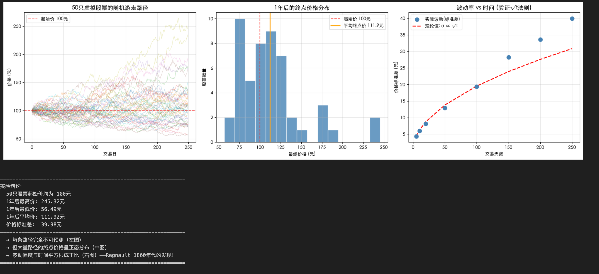
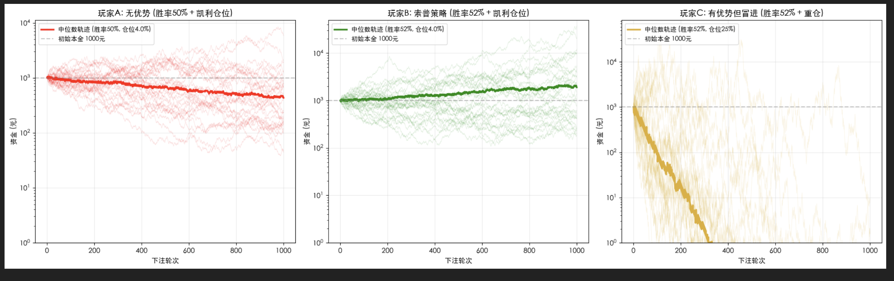
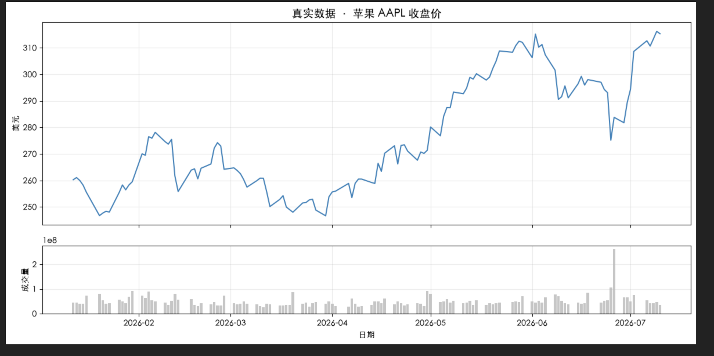
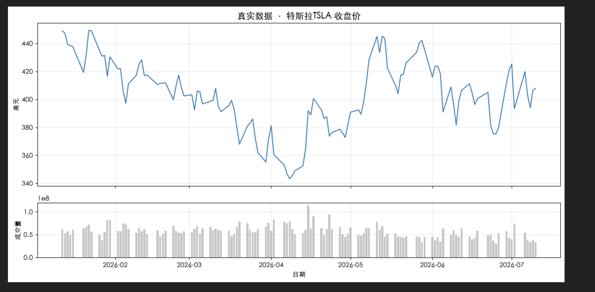
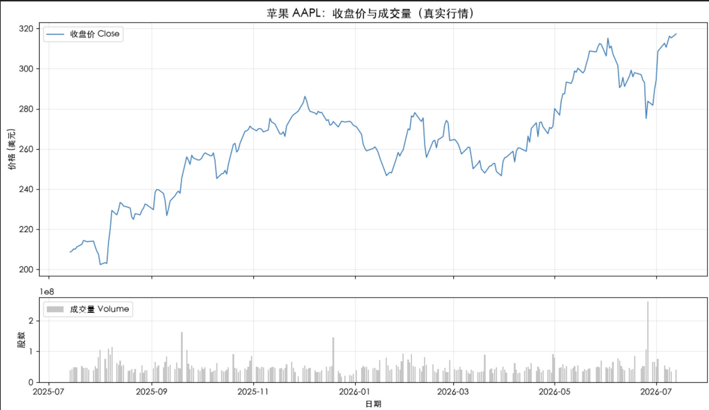
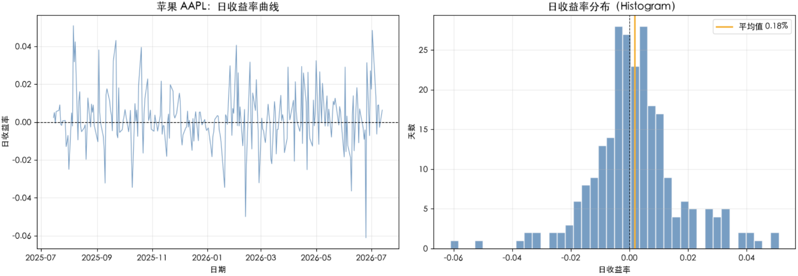
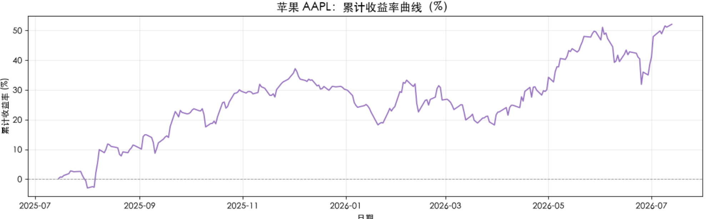
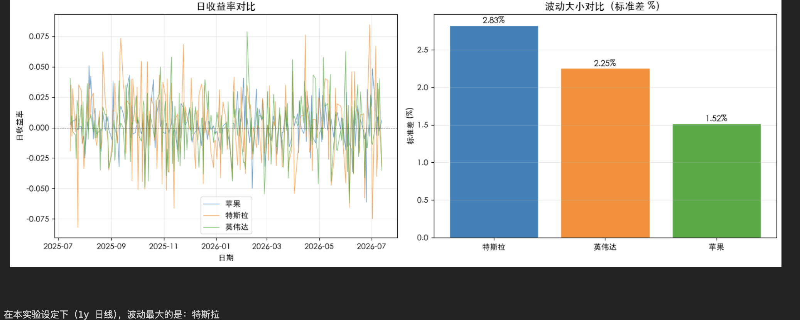

# Phase 1：量化金融入门

## 一、阶段目标

- 理解量化金融的基本思维
- 使用 Python 获取和分析股票数据
- 计算收益率和简单波动指标
- 使用移动平均线构建交易规则
- 对交易策略进行基础回测
- 从收益和风险两个角度解释回测结果

核心学习链路：

```text
提出假设 → 获取数据 → 分析数据 → 制定规则 → 历史回测 → 解释结果
```

## 二、环境准备

- Python 3
- Jupyter Lab
- pandas、numpy
- matplotlib、seaborn
- yfinance、akshare
- 可正常访问行情数据的网络环境

启动课程：

```bash
cd squant-for-beginners
source .venv/bin/activate
python -m jupyter lab
```

## 三、第一章：什么是量化金融

### 核心知识

- 量化金融的基本定义
  - 量化金融是金融学、数学、统计学与计算机科学的交叉学科。它利用算法、数学模型和海量数据来分析金融市场，广泛应用于资产定价、风险管理和程序化交易。该领域旨在通过严格的数据分析消除人为情绪干扰，优化投资回报。
- 主观交易与量化交易的区别
  - **主观交易**依赖交易员个人的经验、逻辑分析和盘感做出决策；**量化交易**则依靠数学模型和计算机代码，通过回测历史数据并执行自动化策略来获取超额收益。两者核心区别在于“决策依据”与“执行方式”的不同
- 量化研究的四步流程
  - **数据处理**、**因子开发**、**组合优化**与**回测执行**
- Python 在量化研究中的作用
- 随机游走与概率优势
  - **随机游走**（Random Walk）是一个数学统计模型，描述的是没有固定方向、每一步都完全独立的随机轨迹。当它与**概率优势**（Probability Edge）结合时，揭示了一个深刻的核心法则：**在不确定性的随机系统中，哪怕只有微小的概率优势，经过无限次重复，最终也会导致结果的必然倾斜（如著名的“赌徒输光定理”）。**

### 实操任务

- **实验一：模拟布朗运动**
  - 单只股票的走势无法预测——每条路径随机且不重复
  - 大量股票的统计规律是确定的——终点价格服从正态分布，波动√t成正比
  - 不预测单一结果，利用统计规律

```python
# ========== 实验一：布朗运动 / 随机游走 ==========
import numpy as np                       # 数值计算（数组、随机数、统计）
import matplotlib.pyplot as plt            # 绘图库（折线图、柱状图等）

plt.rcParams['font.sans-serif'] = ['Heiti SC', 'Arial Unicode MS', 'Hiragino Sans GB', 'Microsoft YaHei', 'SimHei', 'Noto Sans CJK SC']  # 跨平台中文字体回退
plt.rcParams['axes.unicode_minus'] = False      # 坐标轴负号正常显示

np.random.seed(2026)        # 固定随机种子

n_stocks = 50               # 模拟 50 只「虚拟股票」
n_days = 250                # 每只走 250 个交易日（约一年）
start_price = 100           # 起始价都是 100 元
daily_volatility = 0.02     # 日波动强度（标准差约2%）

fig, axes = plt.subplots(1, 3, figsize=(18, 5))  # 1行3列，三个子图

# --- 左图：画出 50 条价格路径 ---
all_paths = []              # 用来存每只股票的路径
for _ in range(n_stocks):   # 循环 50 次，每只股一条路径
    daily_returns = np.random.normal(0, daily_volatility, n_days)  # 每天随机收益
    price_path = start_price * np.cumprod(1 + daily_returns)       # 价格连乘
    all_paths.append(price_path)          # 存入列表
    axes[0].plot(price_path, alpha=0.3, linewidth=0.8)  # 画在左图，半透明

axes[0].axhline(y=start_price, color='red', linestyle='--', alpha=0.5, label='起始价 100元')  # 参考线
axes[0].set_title('50只虚拟股票的随机游走路径', fontsize=13)  # 设置上图标题
axes[0].set_xlabel('交易日')  # 执行本行代码
axes[0].set_ylabel('价格 (元)')  # 设置上图纵轴
axes[0].legend()  # 显示上图图例
axes[0].grid(True, alpha=0.3)  # 上图显示网格

# --- 中图：一年后的终点价格分布（直方图）---
final_prices = [path[-1] for path in all_paths]   # 取每条路径最后一天的价格
axes[1].hist(final_prices, bins=15, color='steelblue', edgecolor='white', alpha=0.8)  # 画直方图
axes[1].axvline(x=start_price, color='red', linestyle='--', label=f'起始价 {start_price}元')  # 中图画垂直参考线
axes[1].axvline(x=np.mean(final_prices), color='orange', linestyle='-', linewidth=2,  # 中图画垂直参考线
                label=f'平均终点价 {np.mean(final_prices):.1f}元')  # 图例文字
axes[1].set_title('1年后的终点价格分布', fontsize=13)  # 设置下图标题
axes[1].set_xlabel('最终价格 (元)')  # 设置下图横轴（日期）
axes[1].set_ylabel('股票数量')  # 设置下图纵轴
axes[1].legend()                                    # 显示下图图例
axes[1].grid(True, alpha=0.3)  # 下图显示网格

# --- 右图：验证「波动 ∝ 时间的平方根」---
time_points = [5, 10, 20, 50, 100, 150, 200, 250]  # 选取若干观察日
std_at_time = []                                    # 存放每个时点的价格标准差
for t in time_points:  # 代码块开始
    prices_at_t = [path[t-1] for path in all_paths]  # 所有股票在第 t 天的价格
    std_at_time.append(np.std(prices_at_t))         # 算标准差

sqrt_time = np.sqrt(time_points)                    # 时间开平方
scale = std_at_time[0] / sqrt_time[0]               # 缩放系数，让理论线对齐第一个点

axes[2].scatter(time_points, std_at_time, s=80, color='steelblue', zorder=5, label='实际波动(标准差)')  # 右图：散点
axes[2].plot(time_points, scale * sqrt_time, 'r--', linewidth=2, label='理论值: σ ∝ √t')  # 右图：理论曲线
axes[2].set_title('波动率 vs 时间 (验证√t法则)', fontsize=13)  # 设置右图标题
axes[2].set_xlabel('交易天数')  # 执行本行代码
axes[2].set_ylabel('价格标准差 (元)')  # 执行本行代码
axes[2].legend()  # 执行本行代码
axes[2].grid(True, alpha=0.3)  # 透明度

plt.tight_layout()                       # 自动调整子图间距，避免标签被裁切
plt.show()                               # 在 Notebook 里显示图片

# ========== 打印文字结论 ==========
print("=" * 60)  # 打印输出
print("实验结论：")  # 打印输出
print(f"  50只股票起始价均为 {start_price}元")  # 打印价格统计
print(f"  1年后最高价: {max(final_prices):.2f}元")  # 打印价格统计
print(f"  1年后最低价: {min(final_prices):.2f}元")  # 打印价格统计
print(f"  1年后平均价: {np.mean(final_prices):.2f}元")  # 格式化打印
print(f"  价格标准差:  {np.std(final_prices):.2f}元")  # 格式化打印
print("-" * 60)  # 打印输出
print("  → 每条路径完全不可预测（左图）")  # 打印分隔线或结论
print("  → 但大量路径的终点价格呈正态分布（中图）")  # 打印分隔线或结论
print("  → 波动幅度与时间平方根成正比（右图）——Regnault 1860年代的发现！")  # 打印分隔线或结论
print("=" * 60)  # 打印输出

```



- **实验二：索普——概率优势**


```python
# ========== 实验二：索普——概率优势 + 凯利仓位 ==========
import numpy as np                       # 数值计算（数组、随机数、统计）
import matplotlib.pyplot as plt            # 绘图库（折线图、柱状图等）

plt.rcParams['font.sans-serif'] = ['Heiti SC', 'Arial Unicode MS', 'Hiragino Sans GB', 'Microsoft YaHei', 'SimHei', 'Noto Sans CJK SC']  # 跨平台中文字体回退
plt.rcParams['axes.unicode_minus'] = False      # 坐标轴负号正常显示

np.random.seed(2026)  # 固定随机种子，结果可复现

n_rounds = 1000             # 每位玩家模拟下注 1000 轮
n_simulations = 200         # 每种策略重复 200 次（看分布）
initial_capital = 1000      # 初始本金 1000 元

win_prob_no_edge = 0.50     # 玩家A：无优势，胜率 50%
win_prob_edge = 0.52        # 玩家B/C：有 2% 概率优势
payout_ratio = 1.0          # 赔率 1:1（赢一倍赌注，输一倍赌注）

# 凯利公式: f* = (bp - q) / b  → 最优下注占本金比例
kelly_fraction = (payout_ratio * win_prob_edge - (1 - win_prob_edge)) / payout_ratio  # 凯利公式最优下注比例
aggressive_fraction = 0.25  # 玩家C：有优势但每次下注 25%（太激进）


def simulate_player(win_prob, bet_fraction, n_sims=n_simulations):  # 定义模拟下注函数
    """模拟多人在 n_rounds 轮里的资金曲线。"""  # 字典字段
    all_curves = []              # 存放每次实验的资金曲线
    for _ in range(n_sims):              # 外层：重复很多次实验
        capital = initial_capital        # 本轮起始资金
        curve = [capital]              # 记录每轮后的资金
        for _ in range(n_rounds):      # 内层：一轮轮下注
            bet = capital * bet_fraction   # 本轮下注额 = 本金 × 比例
            if np.random.random() < win_prob:  # 随机数小于胜率 → 赢
                capital += bet * payout_ratio  # 赢：拿回赌注并赚一倍
            else:                              # 否则 → 输
                capital -= bet                 # 输：输掉本轮赌注
            capital = max(capital, 0.01)       # 防止资金变成负数
            curve.append(capital)  # 执行本行代码
        all_curves.append(curve)  # 执行本行代码
    return np.array(all_curves)        # 转成二维数组：行=实验，列=轮次


curves_A = simulate_player(win_prob_no_edge, kelly_fraction)       # 无优势 + 凯利
curves_B = simulate_player(win_prob_edge, kelly_fraction)          # 有优势 + 凯利
curves_C = simulate_player(win_prob_edge, aggressive_fraction)     # 有优势 + 重仓

fig, axes = plt.subplots(1, 3, figsize=(18, 5.5))  # 三个玩家各一张子图

configs = [  # 三个子图的配置
    (curves_A, '玩家A: 无优势 (胜率50% + 凯利仓位)', 'red', f'胜率50%, 仓位{kelly_fraction*100:.1f}%'),  # 执行本行代码
    (curves_B, '玩家B: 索普策略 (胜率52% + 凯利仓位)', 'green', f'胜率52%, 仓位{kelly_fraction*100:.1f}%'),  # 执行本行代码
    (curves_C, '玩家C: 有优势但冒进 (胜率52% + 重仓)', 'goldenrod', f'胜率52%, 仓位25%'),  # 执行本行代码
]                                              # 数组拼接结束

for ax, (curves, title, color, label) in zip(axes, configs):  # 为每个玩家画子图
    for i in range(min(30, n_simulations)):   # 只画前30条细线，避免太乱
        ax.plot(curves[i], alpha=0.15, linewidth=0.6, color=color)  # 在子图上画折线
    median_curve = np.median(curves, axis=0)  # 200次实验的中位数轨迹
    ax.plot(median_curve, color=color, linewidth=2.5, label=f'中位数轨迹 ({label})')  # 在子图上画折线
    ax.axhline(y=initial_capital, color='gray', linestyle='--', alpha=0.5, label=f'初始本金 {initial_capital}元')  # 画水平参考线
    ax.set_title(title, fontsize=12, fontweight='bold')  # 设置子图标题
    ax.set_xlabel('下注轮次')  # 设置子图横轴
    ax.set_ylabel('资金 (元)')  # 设置子图纵轴
    ax.legend(fontsize=9, loc='upper left')  # 显示图例
    ax.grid(True, alpha=0.3)  # 显示网格
    ax.set_yscale('log')      # 纵轴用对数刻度，差距大时更好看
    ax.set_ylim(1, None)  # 设置纵轴范围

plt.tight_layout()                       # 自动调整子图间距，避免标签被裁切
plt.show()                               # 在 Notebook 里显示图片

print("=" * 70)  # 打印输出
print(f"凯利公式计算: 最优下注比例 f* = {kelly_fraction*100:.2f}% (胜率52%, 赔率1:1)")  # 打印凯利公式结果
print("=" * 70)  # 打印输出

for name, curves, color in [("玩家A (无优势)", curves_A, "red"),  # 打印各玩家统计
                              ("玩家B (索普策略)", curves_B, "green"),  # 执行本行代码
                              ("玩家C (有优势但冒进)", curves_C, "goldenrod")]:  # 代码块开始
    finals = curves[:, -1]                    # 每个实验最后一轮的资金
    win_rate = np.mean(finals > initial_capital) * 100  # 最终赚钱的比例
    median_final = np.median(finals)  # 赋值：median_final
    print(f"\n  【{name}】")  # 格式化打印
    print(f"    中位数终点资金: {median_final:,.0f}元")  # 格式化打印
    print(f"    盈利概率: {win_rate:.1f}%")  # 格式化打印
    print(f"    最好情况: {np.max(finals):,.0f}元 | 最差情况: {np.min(finals):,.2f}元")  # 格式化打印

print("\n" + "=" * 70)  # 打印输出
print("  → 没有概率优势，凯利公式也救不了你（玩家A）")  # 打印分隔线或结论
print("  → 仅仅2%的胜率优势 + 科学仓位管理 = 长期稳定复利（玩家B）")  # 打印分隔线或结论
print("  → 有优势但仓位过重，反而可能亏光（玩家C）")  # 打印分隔线或结论
print("  → 这就是索普的核心发现：概率优势 × 仓位管理 = 量化盈利的底层公式")  # 打印分隔线或结论
print("=" * 70)  # 打印输出

```



- 使用代码下载 AAPL 行情

```python
# ========== 第一章爽点：下载真实股票数据 ==========
import pandas as pd                  # 处理 Yahoo 返回的行情数据
import matplotlib.pyplot as plt     # 画图
from curl_cffi import requests      # 发起兼容浏览器 TLS 的网络请求

plt.rcParams['font.sans-serif'] = ['Heiti SC', 'Arial Unicode MS', 'Hiragino Sans GB', 'Microsoft YaHei', 'SimHei', 'Noto Sans CJK SC']  # 跨平台中文字体回退
plt.rcParams['axes.unicode_minus'] = False      # 坐标轴负号正常显示

# 直接请求 Yahoo Chart 接口，避开被广告规则拦截的 cookie 端点
def download_yahoo_chart(ticker, period='6mo', interval='1d'):
    response = requests.get(
        f'https://query1.finance.yahoo.com/v8/finance/chart/{ticker}',
        params={
            'range': period,
            'interval': interval,
            'events': 'div,splits',
        },
        impersonate='chrome',
        timeout=20,
    )
    response.raise_for_status()

    chart = response.json()['chart']
    error = chart['error']
    if error is not None or not chart['result']:
        raise RuntimeError(f'Yahoo 行情下载失败: {error}')

    result = chart['result'][0]
    quote = result['indicators']['quote'][0]
    dates = (
        pd.to_datetime(result['timestamp'], unit='s', utc=True)
        .tz_convert('America/New_York')
        .tz_localize(None)
        .normalize()
    )

    data = pd.DataFrame({
        'Open': quote['open'],
        'High': quote['high'],
        'Low': quote['low'],
        'Close': quote['close'],
        'Volume': quote['volume'],
    }, index=dates)
    data.index.name = 'Date'
    data = data.dropna(subset=['Close'])

    if data.empty:
        raise RuntimeError(f'{ticker} 没有返回有效行情')

    return data


# 下载苹果 AAPL 最近 6 个月的日线（需要联网）
aapl = download_yahoo_chart('AAPL', period='6mo')

print('🎉 恭喜！你已经拿到真实股票数据')  # 打印输出
print(f'   共 {len(aapl)} 个交易日')                              # 行数 = 交易日个数
print(f'   最新收盘价: ${aapl["Close"].iloc[-1]:.2f}')            # iloc[-1] = 最后一行
display(aapl.tail(5))   # 在 Notebook 里美观地显示最后 5 行表格

# ========== 上图收盘价、下图成交量 ==========
fig, axes = plt.subplots(2, 1, figsize=(12, 6), sharex=True,       # 2行子图，横轴对齐
                         gridspec_kw={'height_ratios': [3, 1]})    # 上图占 3 份高度
axes[0].plot(aapl.index, aapl['Close'], color='tab:blue', linewidth=1.5)  # 折线：收盘价
axes[0].set_title('真实数据 · 苹果 AAPL 收盘价', fontsize=14)  # 设置上图标题
axes[0].set_ylabel('美元')  # 设置上图纵轴
axes[0].grid(True, alpha=0.3)  # 上图显示网格
axes[1].bar(aapl.index, aapl['Volume'], width=0.8, color='gray', alpha=0.5)  # 柱状：成交量
axes[1].set_ylabel('成交量')  # 设置下图纵轴
axes[1].set_xlabel('日期')  # 设置下图横轴（日期）
axes[1].grid(True, alpha=0.3)  # 下图显示网格

plt.tight_layout()                       # 自动调整子图间距，避免标签被裁切
plt.show()                               # 在 Notebook 里显示图片

```



- 观察股票价格和成交量
- 将股票替换为 TSLA 或 NVDA



- 判断近 6 个月的整体走势

## 四、第二章：收益率与数据分析

预计时间：45～60 分钟

### 本章目标

学完这一章，你将完成第一次真正的量化数据分析，并能够：

- 看懂股票日线数据中的 OHLCV 字段
- 理解价格变化和收益率的区别
- 使用 pandas 计算每日收益率
- 通过折线图和直方图观察收益率
- 理解累计收益率是如何计算出来的
- 使用标准差比较不同股票的波动大小

本章的学习路线是：

```text
读取行情数据 → 选择收盘价 → 计算日收益率 → 画图观察 → 比较波动
```

> 本章使用苹果 AAPL、特斯拉 TSLA 和英伟达 NVDA 作为例子。行情数据会不断更新，因此你实际运行代码时，日期、价格和统计结果可能与笔记中的示例不同，这是正常现象。

### 2.1 认识股票行情数据：OHLCV

股票软件里的一根“日 K 线”，其实是在总结一天内的价格变化。在量化分析中，这些信息通常以表格形式保存：**一行代表一个交易日，一列代表一种信息**。

最常见的五列合称 **OHLCV**：


| 列名      | 英文     | 含义（直觉版）        |
| ------- | ------ | -------------- |
| **开盘**  | Open   | 当天第一笔成交价       |
| **最高**  | High   | 当天成交过的最高价      |
| **最低**  | Low    | 当天成交过的最低价      |
| **收盘**  | Close  | 当天最后一笔成交价（最常用） |
| **成交量** | Volume | 当天一共成交了多少股     |


例如，某天苹果股票的数据如下：

```text
Open = 210，High = 215，Low = 208，Close = 213，Volume = 5000 万
```

可以这样理解：当天以 210 美元附近开盘，盘中最高到过 215 美元、最低到过 208 美元，最后以 213 美元收盘，共成交约 5000 万股。

一天内的价格通常满足：

```text
Low ≤ Open、Close ≤ High
```

也就是说，开盘价和收盘价应该落在当天最低价与最高价之间。

#### 为什么经常使用收盘价

收盘价代表市场在当天交易结束时形成的价格。计算每日涨跌、绘制长期趋势或构建简单策略时，我们通常先使用 `Close`，这样每天都有一个统一的比较基准。

```python
# 下载苹果最近 1 年的日线数据
aapl = download_yahoo_chart('AAPL', period='1y')

print('数据形状（行数, 列数）：', aapl.shape)
display(aapl.head())
```

- `aapl.shape` 用来查看表格有多少行、多少列
- `aapl.head()` 显示最前面的 5 行
- 左侧的 `Date` 是日期索引，不是普通数据列
- 一年通常约有 250 个交易日，而不是 365 个自然日，因为周末和休市日没有交易

> Open	High	Low	Close	Volume
> Date					
> 2025-07-14	209.929993	210.910004	207.539993	208.619995	38840100
> 2025-07-15	209.220001	211.889999	208.919998	209.110001	42296300
> 2025-07-16	210.300003	212.399994	208.639999	210.160004	47490500
> 2025-07-17	210.570007	211.800003	209.589996	210.020004	48068100
> 2025-07-18	210.869995	211.789993	209.699997	211.179993	48974600

#### 收盘价和复权价格有什么区别

- **收盘价（Close）**：当天真实记录的收盘价格
- **复权价格（Adjusted Price）**：对拆股、分红等事件进行调整后的历史价格，方便跨越较长时间公平比较

举个简化例子：一只 100 元的股票进行“1 股拆成 2 股”后，每股价格会变成约 50 元，但持有人的总资产并没有突然损失 50%。如果直接观察未复权价格，图上会像是出现了一次暴跌；复权价格会修正这种由公司行为带来的断层。

本章 Notebook 的 `download_yahoo_chart()` 使用 Yahoo 返回的 `Close`，**没有另外计算复权价**。用它完成入门练习没有问题，但以后做跨越分红、拆股的长期回测时，应优先确认数据是否已经复权。



### 2.2 什么是收益率

只比较“赚了多少钱”并不公平。投入 100 元赚 10 元，与投入 10000 元赚 10 元，显然不是同一回事。因此，量化分析更关心**价格变化占原价格的比例**，这个比例就是收益率。

#### 先从 100 元的例子开始

假设昨天用 100 元买入一只股票：

- 今天涨到 110 元：赚了 10 元，收益率为 `10 ÷ 100 = 10%`
- 今天跌到 90 元：亏了 10 元，收益率为 `-10 ÷ 100 = -10%`

这里需要区分小数和百分数：

```text
0.10 = 10%
0.01 = 1%
0.001 = 0.1%
```

Python 通常用小数保存收益率，但可以通过 `:.2%` 把它显示为百分数：

```python
p_yesterday = 100
p_today = 110

r = (p_today - p_yesterday) / p_yesterday
print(f'日收益率：{r:.2%}')
```

输出为：

```text
日收益率：10.00%
```

#### 日收益率公式

设昨天的收盘价为 $P_{t-1}$，今天的收盘价为 $P_t$，那么今天的简单收益率为：

$$
r_t = \frac{P_t - P_{t-1}}{P_{t-1}}
$$

也可以写成：

$$
r_t = \frac{P_t}{P_{t-1}} - 1
$$

两种写法完全等价。记忆时只需要记住一句话：**今天比昨天多出来的部分，占昨天价格的比例。**

> 注意：先跌 10% 再涨 10%，不会回到原点。100 元跌 10% 后是 90 元，90 元再涨 10% 只有 99 元。因为第二次计算收益率时，本金已经变成了 90 元。

### 2.3 使用 pandas 计算日收益率

真实数据有几百行，不需要逐日手算。pandas 的 `pct_change()` 会自动计算当前一行相对于上一行的变化比例：

```python
df = aapl[['Close']].copy()
df['日收益率'] = df['Close'].pct_change()

display(df.tail(10))
```

逐行理解这段代码：

1. `aapl[['Close']]` 只选出收盘价，并保留 DataFrame 表格结构
2. `.copy()` 创建一个副本，避免后续修改影响原始数据
3. `pct_change()` 计算今天相对昨天的涨跌比例
4. 计算结果保存到新列 `日收益率`

`pct_change()` 在内部做的仍然是：

```text
(今天收盘价 - 昨天收盘价) ÷ 昨天收盘价
```

#### 为什么第一天是 NaN

第一条价格数据没有“前一天”可以比较，所以第一条收益率无法计算。pandas 会用 `NaN` 表示这个缺失值。它不是程序出错，也不代表当天收益率为 0。

在画图或计算统计指标前，可以用 `dropna()` 去掉这一项：

```python
rets = df['日收益率'].dropna()
```

如果下载到 251 个价格，通常只能算出 250 个日收益率，因为计算一个收益率需要前后两个价格。

#### 手算一次，检查代码是否正确

```python
today = df.iloc[-1]
yesterday = df.iloc[-2]

manual_r = (
    today['Close'] - yesterday['Close']
) / yesterday['Close']

print(f"手算结果：{manual_r:.4%}")
print(f"pandas 结果：{today['日收益率']:.4%}")
```

如果两行结果一致，就说明我们对公式和 `pct_change()` 的理解是相同的。

> **待补充：** 粘贴你运行后最后 10 天的收盘价与日收益率，并记录最后一天的手算结果和 pandas 结果。

#### 用 describe() 快速认识数据

`describe()` 会一次给出一组常用统计量：

```python
display(rets.describe())
```

重点先看下面几项：


| 指标      | 含义     | 初学者可以怎样理解    |
| ------- | ------ | ------------ |
| `count` | 有效数据数量 | 一共统计了多少个交易日  |
| `mean`  | 平均值    | 平均每天涨跌多少     |
| `std`   | 标准差    | 每天的涨跌有多剧烈    |
| `min`   | 最小值    | 样本中单日跌幅最大的一天 |
| `max`   | 最大值    | 样本中单日涨幅最大的一天 |


`mean` 很小并不表示每天都只小幅变化。一天大涨、另一天大跌，平均后可能接近 0，因此还需要结合 `std`、`min`、`max` 和图形一起观察。

### 2.4 用图看懂收益率

表格适合查看精确数字，图形更适合发现模式。本章使用两种图：收益率曲线和收益率直方图。

#### 日收益率曲线：看“什么时候波动”

```python
plt.figure(figsize=(12, 4))
plt.plot(rets.index, rets.values, color='steelblue', linewidth=0.9)
plt.axhline(0, color='black', linestyle='--', linewidth=0.8)
plt.title('苹果 AAPL：日收益率曲线')
plt.xlabel('日期')
plt.ylabel('日收益率')
plt.grid(True, alpha=0.3)
plt.show()
```

读图时关注三点：

1. 0 轴上方代表当天上涨，下方代表当天下跌
2. 离 0 轴越远，当天涨跌越大
3. 如果某一段时间尖峰密集，说明那段时间市场波动更剧烈

收益率曲线的上下跳动通常比价格曲线杂乱，这是金融数据中常见的“噪声”。

#### Histogram：看“涨跌主要集中在哪里”

Histogram 的中文名是**直方图**。它不再强调日期，而是把相近的收益率放进同一个区间，再统计每个区间出现了多少天。

```python
plt.figure(figsize=(8, 4))
plt.hist(rets.values, bins=40, color='steelblue', edgecolor='white')
plt.axvline(0, color='black', linestyle='--', linewidth=0.8)
plt.axvline(
    rets.mean(),
    color='orange',
    linewidth=2,
    label=f'平均值 {rets.mean():.2%}',
)
plt.title('苹果 AAPL：日收益率分布')
plt.xlabel('日收益率')
plt.ylabel('天数')
plt.legend()
plt.show()
```

- 横轴：日收益率区间，例如 `-2%～-1%`
- 纵轴：落在该区间内的交易日数量
- 中间柱子较高：大多数交易日的涨跌比较小
- 两边仍有少量柱子：偶尔会出现大涨或大跌

直方图两侧延伸出去的部分常被称为“尾部”。尾部较长或极端值较多，说明这只股票虽然多数时候变化不大，但仍可能突然出现较大的单日涨跌。




### 2.5 累计收益率

日收益率回答“今天相对昨天涨跌多少”，累计收益率回答“从第一天持有到现在，总共涨跌多少”。

累计收益不能把每天的收益率直接相加，因为每天涨跌所作用的本金会发生变化。正确方式是把每天的增长倍数 `1 + r` 连乘：

$$
R_t = (1+r_1)(1+r_2)\cdots(1+r_t)-1
$$

例如，100 元先涨 10%，再跌 10%：

```text
第一天：100 × (1 + 10%) = 110
第二天：110 × (1 - 10%) = 99
累计收益率：(1.10 × 0.90) - 1 = -1%
```

使用 pandas 只需要一行：

```python
cum_return = (1 + rets).cumprod() - 1
```

- `1 + rets`：把收益率变成每天的资金增长倍数
- `cumprod()`：从第一天开始依次累乘
- `- 1`：把增长倍数重新转换为收益率

绘制累计收益率曲线：

```python
plt.figure(figsize=(12, 4))
plt.plot(cum_return.index, cum_return * 100, color='tab:purple')
plt.axhline(0, color='gray', linestyle='--', linewidth=0.8)
plt.title('苹果 AAPL：累计收益率曲线')
plt.xlabel('日期')
plt.ylabel('累计收益率 (%)')
plt.grid(True, alpha=0.3)
plt.show()

print(f'区间累计收益率：{cum_return.iloc[-1]:.2%}')
```

曲线高于 0 表示相对区间起点盈利，低于 0 表示相对区间起点亏损。这里暂时忽略手续费、税费、滑点和分红，所以它是一个简化结果。




### 2.6 小实验：谁的波动更大

苹果、特斯拉和英伟达都是知名科技公司，但它们每天的涨跌幅度并不相同。我们使用**日收益率的标准差**做一个简单比较。

#### 标准差的直觉

标准差衡量一组数据围绕平均值的分散程度：

- 标准差小：多数日收益率靠近平均值，日常涨跌相对平稳
- 标准差大：日收益率分布更分散，更容易出现较大的上涨或下跌

标准差描述的是**波动大小**，而不是上涨能力。高波动既可能带来大涨，也可能带来大跌。

```python
tickers = {
    'AAPL': '苹果',
    'TSLA': '特斯拉',
    'NVDA': '英伟达',
}

period = '1y'
all_rets = {}

for symbol, name in tickers.items():
    data = download_yahoo_chart(symbol, period=period)
    daily_returns = data['Close'].pct_change().dropna()
    all_rets[name] = daily_returns

vol = pd.Series({
    name: daily_returns.std()
    for name, daily_returns in all_rets.items()
}).sort_values(ascending=False)

print(vol.apply(lambda value: f'{value:.3%}'))
```

代码的执行过程是：

1. 依次下载三只股票相同时间范围的数据
2. 分别计算日收益率并去掉第一行 `NaN`
3. 使用 `daily_returns.std()` 计算每只股票的日波动
4. 按标准差从大到小排序

比较时必须使用相同的时间范围和相同的数据频率。如果苹果使用一年日线，而特斯拉使用三个月小时线，得出的标准差就不能直接比较。

可以用柱状图展示结果：

```python
plt.figure(figsize=(8, 4))
plt.bar(vol.index, vol.values * 100, color=['tab:orange', 'tab:green', 'tab:blue'])
plt.title('三只股票的日收益率波动对比')
plt.ylabel('日收益率标准差 (%)')
plt.grid(True, axis='y', alpha=0.3)

for i, value in enumerate(vol.values):
    plt.text(i, value * 100, f'{value:.2%}', ha='center', va='bottom')

plt.show()
```

Notebook 示例运行结果中，特斯拉的标准差最大，其次是英伟达，苹果最小。但这个排序只描述所选的一年样本；更换运行日期或时间范围后，数值和排序都可能变化。




### 2.7 如何解读实验结果

完成计算只是第一步，更重要的是用准确的语言解释结果。可以使用下面的句式：

> 在所选的一年日线样本中，___ 的日收益率标准差为 ___，在三只股票中最高，因此它在这段历史时期内的日涨跌更剧烈。这个结论只适用于当前样本，不代表它未来一定仍然波动最大。

分析时建议同时回答四个问题：

1. **比较对象是谁？** 例如 AAPL、TSLA、NVDA
2. **数据范围是什么？** 例如最近一年日线
3. **使用了什么指标？** 例如日收益率标准差
4. **结论的边界是什么？** 历史样本只描述过去，不保证未来

#### 怎样理解收益率分布的长尾

如果 Histogram 的中间很高、两侧拖着较长的尾巴，可以理解为：

- 多数交易日涨跌幅较小
- 少数交易日会出现远离平均值的大涨或大跌
- 只观察平均收益率，可能低估极端行情的风险

这也是风险管理重要的原因：平静时期很多，不代表剧烈变化不会发生。

### 常见误区

1. **把价格高低当成收益好坏**
只股票从 20 元涨到 22 元，收益率是 10%；另一只从 200 元涨到 205 元，收益率只有 2.5%。比较表现时应看比例，而不是只看涨了几元。
2. **把 `NaN` 改成 0 后当作真实收益**
一行没有前一天，因此无法计算收益率。为了统计而删除它可以，但不能说第一天真实收益率就是 0。
3. **把平均日收益率直接乘以交易日数**
益会复利累积，准确的累计收益率应使用 `(1 + rets).cumprod() - 1`。
4. **认为标准差越大，收益一定越高**
准差只衡量波动幅度，不区分向上还是向下。大幅亏损同样会增大标准差。
5. **用不同时间范围直接比较**
较多只股票时，应尽量保持起止日期、数据频率和计算方式一致。
6. **把历史结果当成未来预测**
章结果只说明过去一段样本中发生了什么，历史表现不代表未来表现，也不构成投资建议。

### 实操任务

1. 运行 Notebook，查看 AAPL 的 OHLCV 数据，并解释任意一天的五个字段。
2. 手算最后一天的日收益率，再与 `pct_change()` 的结果核对。
3. 绘制 AAPL 的日收益率曲线、Histogram 和累计收益率曲线。
4. 使用 `describe()` 找出样本中的最大单日涨幅和最大单日跌幅。
5. 比较 AAPL、TSLA、NVDA 的日收益率标准差。
6. 把其中一只股票替换成自己关注的公司，重新完成波动比较。
7. 用“对象、时间范围、指标、结论边界”四部分写一段实验结论。

### 本章总结

- OHLCV 描述一个交易日的开盘、最高、最低、收盘和成交量
- 收益率衡量相对变化，100 元涨到 110 元对应 `0.10`，也就是 `10%`
- `pct_change()` 可以计算相邻交易日的简单收益率，第一行出现 `NaN` 是正常的
- 收益率曲线展示波动发生的时间，Histogram 展示收益率出现的频数
- 累计收益率要使用增长倍数连乘，而不是把每日收益率简单相加
- 日收益率标准差可以用于比较波动大小，但高波动不等于高收益
- 所有分析结论都依赖样本区间，历史表现不代表未来表现

### 自查题

1. 为什么 251 个收盘价通常只能计算出 250 个日收益率？
2. 收益率 `0.025` 写成百分数是多少？
3. 为什么先涨 10% 再跌 10% 后，资金没有回到原点？
4. 日收益率曲线和 Histogram 分别适合观察什么？
5. 标准差更大的股票，是否一定能带来更高收益？
6. 为什么比较三只股票时要使用相同的时间范围？

#### 参考答案

1. 第一天没有前一天价格可供比较，因此第一个收益率无法计算。
2. `0.025 = 2.5%`。
3. 两次涨跌作用在不同的本金上，例如 100 元先变成 110 元，再跌到 99 元。
4. 曲线适合观察波动发生的时间，Histogram 适合观察不同涨跌区间出现的频数。
5. 不一定。标准差只表示波动大小，大跌也会增大标准差。
6. 只有统计口径一致，比较结果才有意义。

## 五、第三章：移动平均线策略

预计时间：30～45 分钟

### 核心知识

- 趋势与短期噪声
- 移动平均线的作用
- MA5、MA20 的计算
- 金叉与死叉
- 将交易想法转换为代码规则

### 关键代码

- rolling(window).mean()
- signal = MA5 &gt; MA20
- 买入和卖出信号判断
- 均线与交易点可视化

### 实操任务

- 计算 MA5 和 MA20
- 标记金叉和死叉
- 将股票替换为 TSLA
- 比较 MA5/MA20 与 MA10/MA30
- 观察参数变化对交易次数的影响

### 笔记产出

- 一张策略信号图
- 双均线策略规则说明
- 两组均线参数的比较
- 对“金叉是否一定赚钱”的回答

## 六、第四章：策略回测

预计时间：30～45 分钟

### 核心知识

- 回测的定义与局限
- 持仓状态和策略收益
- 使用 shift(1) 避免未来函数
- 策略与买入持有基准
- 净值曲线、胜率和最大回撤

### 关键代码

- position.shift(1)
- 收益率累乘
- cummax()
- 最大回撤计算
- 策略净值与基准净值比较

### 实操任务

- 回测双均线策略
- 对比策略、买入持有和大盘
- 将标的替换为 NVDA
- 比较 PERIOD = "1y" 和 PERIOD = "5y"
- 分析不同周期的最大回撤

### 笔记产出

- 一张策略净值曲线
- 策略是否跑赢基准的结论
- 1 年与 5 年回测结果比较
- 用三句话解释什么是回测

## 七、Phase 1 成果清单

- [ ] 股票价格与成交量图
- [ ] 收益率分布图
- [ ] 移动平均线策略信号图
- [ ] 策略与基准净值曲线
- [ ] 四章挑战题答案
- [ ] Phase 1 学习总结

## 八、通关检查

- [ ] 能解释量化交易与主观交易的区别
- [ ] 能解释 OHLCV 每个字段
- [ ] 能使用 pct_change() 计算收益率
- [ ] 能使用 rolling() 计算移动平均线
- [ ] 能把交易想法转换为信号
- [ ] 知道为什么回测需要 shift(1)
- [ ] 能解释净值、胜率和最大回撤
- [ ] 知道历史回测不代表未来收益

## 九、阶段复盘

1. Phase 1 中最重要的三个概念是什么？
2. 哪部分代码最难理解？
3. 均线参数变化会怎样影响交易结果？
4. 当前回测忽略了哪些现实因素？
5. 下一阶段最想深入学习什么？

